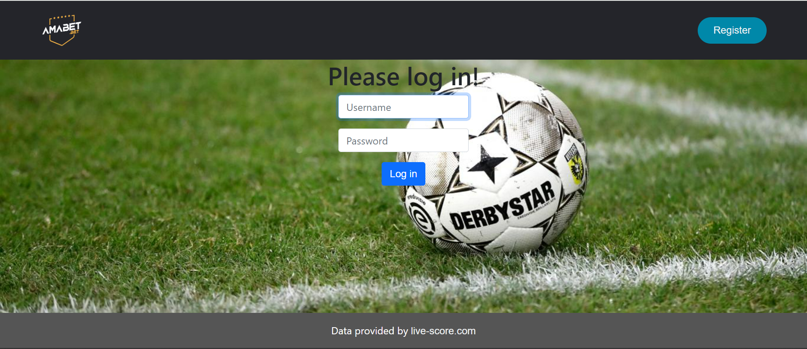
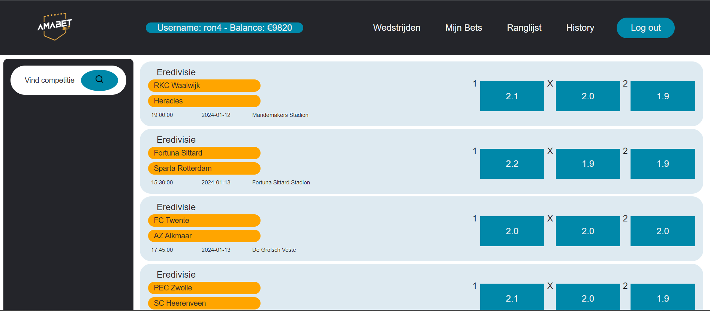
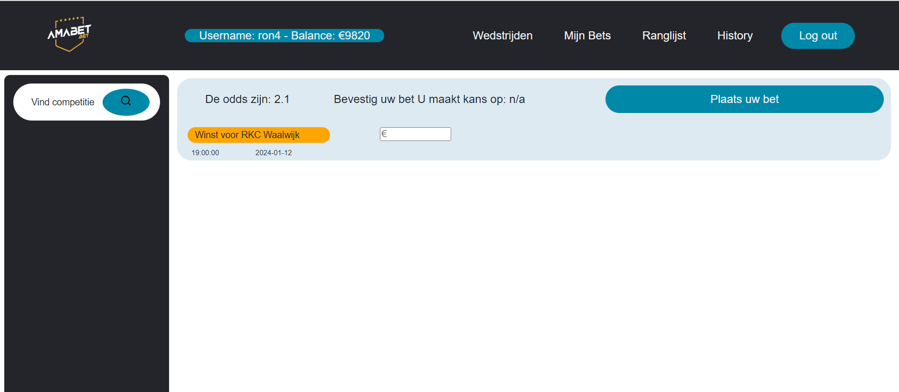
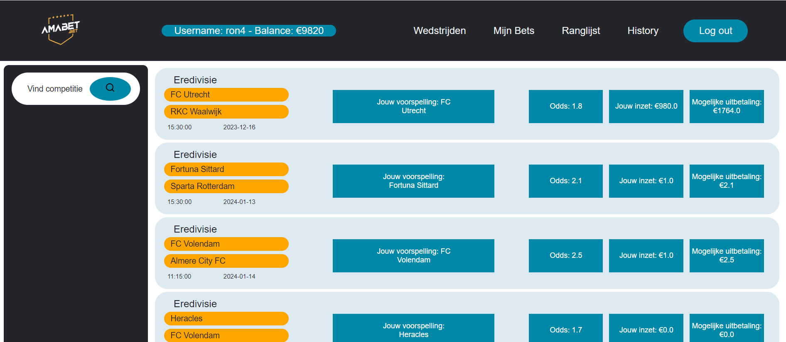
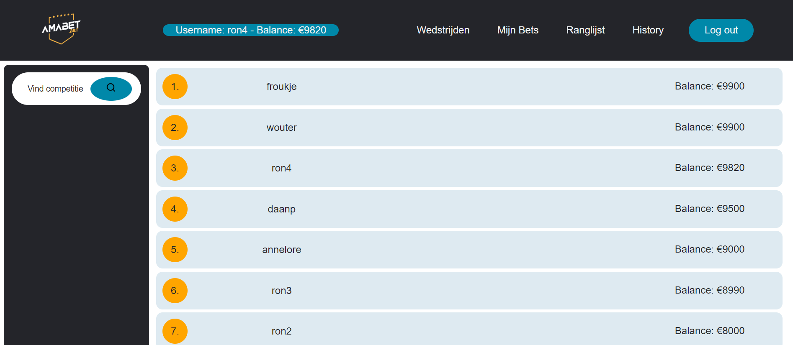
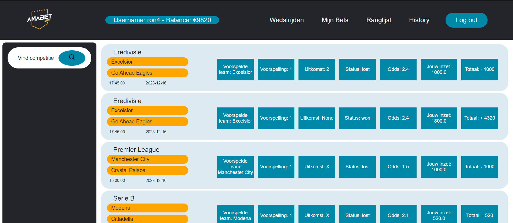

# AMABET by Ron Lakeman
Reclames van betting websites zijn tegenwoordig niet meer weg te denken van de TV, of je mobiele device. Dit heeft als resultaat dat de populariteit van gokwebsites steeds maar blijft stijgen. Dit online gokken is een zeer controversieel, maar tegelijkertijd ook interessant fenomeen. Deze webapplicatie zal daarom de mogelijkheid bieden om aan de hand van nepgeld in te kunnen zetten op live voetbalwedstrijden.

Nadat er door de gebruiker een account wordt aangemaakt, zal deze de mogelijkheid krijgen om te kiezen uit verschillende competities over de hele wereld (zelfs in sommige gevallen op het tweede niveau). Vervolgens worden de aankomende wedstrijden getoont en krijgt de gebruiker de mogelijkheid om in te zetten op een van de twee spelende teams, of een gelijkspel. Nadat er een bedrag wordt ingevoerd en de bet wordt bevestigd, wordt deze opgeslagen in 'mijn bets', waar alle bets overzichtelijk worden weergegeven. In de uren nadat de voetbalwedstrijd is gespeeld, wordt bij inloggen van de wedsite het gewonnen geld uitgekeerd, en wordt de bet verplaatst naar de history. Hier vind de gebruiker een overzicht van alle geplaatste bets, en kan eenvoudig worden teruggevonden of hij/zij de bet heeft gewonnen of verloren, samen met andere informatie over de desbetreffende bet. Ten slotte kan de gebruiker een ranking vinden van alle accounts op basis van de belance. Wanneer een gebruiker veel goed gokt, zal deze hoog in de ranking staan ten opzichte van gebruikers met minder goed geplaatse bets.

## Webpaginas
Log in page van AMABET:



Home page amabet:



Wedstrijdformulier:



Mijn bets page:



Ranking page:



History page:




## Screenrecording
Screenrecording van mijn Project waarin ik de functionaliteit van mijn webpagina Amabet zal demonstreren.

[Link naar screenrecording](https://video.uva.nl/media/Minor%20Programmeren%3A%20Demonstratie%20webapplicatie%20Amabet/0_5htwjcyj)


## Aan de slag 

### Requirements
Deze code is geschreven in Python3.10.12. In requirements.txt staan alle benodigde packages om de code succesvol te draaien. Deze zijn gemakkelijk te installeren via pip dmv. de volgende instructie:

```
pip install -r requirements.txt
```

### Structuur
In de folder static kan de css stylesheet worden gevonden. Dit is, naast bootstrap, de enige stylesheet in de repository.

In de folder templates, kunnen de html files worden gevonden, deze zorgen samen met de stylesheets voor de indeling van de pagina's.

In de folder images, kunnen de afbeeldingen worden teruggevonden die hierboven zijn weergegeven.


In het restant van de repository kunnen app.py, helpers.py en de requirements.txt worden teruggevonden. Deze files zijn nodig om de webpagina draaiende te laten krijgen. Daarnaast staan de nodige md files ook in de repository.

### Testen van de code

Om de code te draaien is het eerst nodig om een database URL te exporteren: 

```
export DATABASE_URL="postgresql://<gebruikersnaam>:<wachtwoord>@localhost/amabet"
```

Vervolgens moeten de tabellen in de tabellen in de database worden aangemaakt. Dit kan worden gedaan door het bestand create.py te runnen.

```
python3 create.py
```

Ten slotte moet de data uit de competities worden geimporteerd in de database. Dit kan worden gedaan door het bestand import_competitions.py te runnen.

```
python3 import_competitions.py
```

Wanneer dit is gedaan kan de webpage op de volgende manier worden gerunt:
```
flask run --debug
```

## Auteurs 
Ron Lakeman

## Dankwoord 
* StackOverflow
* Assitenten minor programmeren van de UvA
* [Skillthrive](https://www.youtube.com/watch?v=PwWHL3RyQgk&t=670sl) - Voor de code voor het stylen van de nav-bar.
* [GreatStack](https://www.youtube.com/watch?v=9hnJsNIBq1g&t=578s) - Voor de code voor het stylen van de searcg-bar.
* [Amabet.bet](https://www.amabet.bet/home?sport=Soccer&live=Tennis) - Voor overname van het logo
* [KNVB](https://www.knvb.nl/nieuws/themas/veiligheid/68237/topoverleg-over-aanpak-gastvrij-en-veilig-voetbal) - voor de achtergrond van de login & register pagina.
* [Maarten-vd-Sande](https://github.com/Maarten-vd-Sande/voorbeeldRepo) - voor een voorbeeld van een juiste repository


