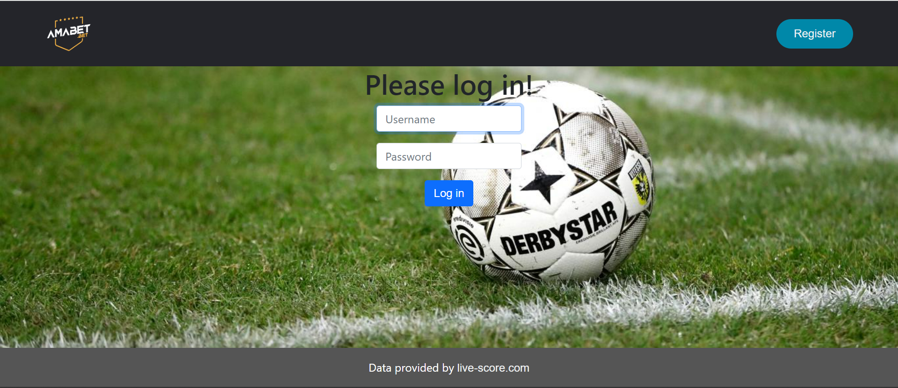

# AMABET by Ron Lakeman
Reclames van betting websites zijn tegenwoordig niet meer weg te denken van de TV, of je mobiele device. Dit heeft als resultaat dat de populariteit van gokwebsites steeds maar blijft stijgen. Dit online gokken is een zeer controversieel, maar tegelijkertijd ook interessant fenomeen. Deze webapplicatie zal daarom de mogelijkheid bieden om aan de hand van nepgeld in te kunnen zetten op live voetbalwedstrijden.

Nadat er door de gebruiker een account wordt aangemaakt, zal deze de mogelijkheid krijgen om te kiezen uit verschillende competities over de hele wereld (zelfs in sommige gevallen op het tweede niveau). Vervolgens worden de aankomende wedstrijden getoont en krijgt de gebruiker de mogelijkheid om in te zetten op een van de twee spelende teams, of een gelijkspel. Nadat er een bedrag wordt ingevoerd en de bet wordt bevestigd, wordt deze opgeslagen in 'mijn bets', waar alle bets overzichtelijk worden weergegeven. In de uren nadat de voetbalwedstrijd is gespeeld, wordt bij inloggen van de wedsite het gewonnen geld uitgekeerd, en wordt de bet verplaatst naar de history. Hier vind de gebruiker een overzicht van alle geplaatste bets, en kan eenvoudig worden teruggevonden of hij/zij de bet heeft gewonnen of verloren, samen met andere informatie over de desbetreffende bet. Ten slotte kan de gebruiker een ranking vinden van alle accounts op basis van de belance. Wanneer een gebruiker veel goed gokt, zal deze hoog in de ranking staan ten opzichte van gebruikers met minder goed geplaatse bets.

## Sketch
Middels de volgende sketches zal ik een indruk geven van hoe mijn pagina's er uit zullen komen te zien en wat de functionaliteiten zijn.

### Log in

Dit is een eenvoudige schets van mijn login pagina die de gebruiker om een gebruikersnaam en wachtwoord vraag. Wanneer de gebruiker nog geen account heeft, kan een account worden aangemaakt met de register knop. Eventueel zou deze pagina kunnen worden opgeleukt door een de gebruikers met de hoogste score te tonen. Op deze manier wordt de gebruiker extra gestimuleerd om een account aan te maken.

### Register
 2.jpeg>)
De register pagina werkt net als de register pagina op de ‘finance’ website. Hier niet veel bijzonderheden.

### Index
 1.jpeg>)
Deze pagina zal fungeren als de ‘main page’ van mijn webapplicatie. Vanuit deze pagina heb je verschillende mogelijkheden.

Bovenaan de pagina zal een navigatie bar worden getoond waarmee het mogelijk zal zijn om de verschillende pagina’s van de website op een simpele manier te vinden. Het kopje 'wedstrijden' zal hetzelfde tonen als wanneer er op 'AmaBet' Wordt gedrukt. Dit is het volgende

Dit deze zullen een overzicht geven van alle wedstrijden in de geselecteerde competitie voor het eerstvolgende weekend. Daarnaast zal er per wedstrijd 3 buttons worden getoond waarmee kan worden ingezet op 1. Winst team 1, 2. Gelijkspel, 3. Winst team 2. Wanneer een van deze opties wordt aangeklikt zal er een pop-up scherm worden getoond waarin ingevuld kan worden hoeveel punten je op de wedstrijd wilt inzetten, en je je bet kan bevestigen. De odds van de bets zullen worden gegenereerd middels een functie. Deze zal worden gebaseerd op de stand van de 2 ploegen. In de praktijk zorgt dit er voor dat je relatief weinig punten verdient wanneer je een goede voorspelling maakt voor een team dat hoog in de ranglijst staat, en je relatief veel punten verdient bij een goede voorspelling voor een team dat laag in de ranglijst staat. Deze functie zal ik zelf bedenken.

Daarnaast is het mogelijk om middels een zoek functie je eigen competitie op te zoeken en toe te voegen aan je favorieten. Wanner dat is gedaan zullen deze als button onder de zoek functie blijven staan. Deze buttons kunnen vervolgens worden gebruikt om naar de wedstrijden van de desbetreffende competitie te navigeren. Dit deel van de pagina zal op elke pagina blijven staan. Om deze reden kan dit deel van de pagina aan de lay-out pagina worden toegevoegd.

### Mijn bets
Deze pagina zal (1) een overzicht geven van alle geplaatste bets met de bijbehorende datum. Daarnaast zal het een waarschuwing geven tot wanneer je de bet kunt aanpassen (deadline = dag voor desbetreffende wedstrijd 23:59)(staat niet in de schets). En zal (2) een overzicht geven van de punten die behaald zijn uit de bets van afgelopen weekend. Deze zogeheten ‘closed bets’ zullen info geven over de gezette bet, en hoeveel punten er verdiend/verloren zijn per wedstrijd.

### Ranking
 1 (1).jpeg>)
Deze pagina zal een overzicht geven van de TOP 30 accounts gesorteerd op meeste punten. Op deze manier kan je zien welke gebruikers de hoogste scores hebben en daarmee de beste voorspellers zijn.

## Features
Nodige features:
1. Login functie
2. Register functie
3. Zoekbalk voor teams & competities
4. nav-bar voor verschillende pagina's 
5. Mogelijkheid om bets te plaatsen op real life voetbalwedstrijden
6. Overzicht van geplaatste bets
7. Mogelijkheid om geplaatste bets te veranderen voor de desbetreffende speeldag.
8. History van geplaatste bets
9. Ranglijst met alle gebruikers (beste gebruikers bovenaan)

Extra features:
1. pagina met grafiek van scoreverloop
2. Mogelijkheid om alternatieve bets te zetten (bijv. both teams to score of multiplier)
3. Pagina met aantal betting statistieken

## Requirements
Om mijn website te laten werken zoals behoren, heb ik een API nodig die beschikbaar is gesteld door de KNVB via de website: https://api.knvbdataservice.nl/.

Daarnaast heb ik verschillende libary's nodig voor mijn website. Zo wil ik sqlalchemy gebruiken voor het scrapen van bepaalde data, en daarnaast wil ik bootstrap gebruiken voor bepaalde functionaliteiten op mijn website (noem een nav. bar).

Om eerlijk te zijn vind ik het lastig om precies aan te geven welke libary's ik waarvoor wil gebruiken. Daarnaast moet ik mij ook verder verdiepen in hoe de ik de API kan gebruiken om bepaalde data te gebruiken. Echter ben ik er wel van overtuigd dat het op korte termijn moet lukken om dit uit te zoeken en ik aan de gang kan met het project.